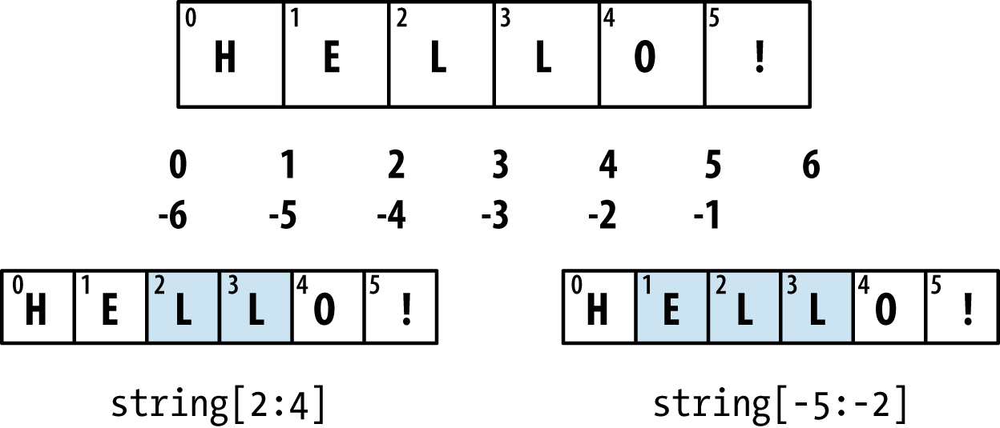
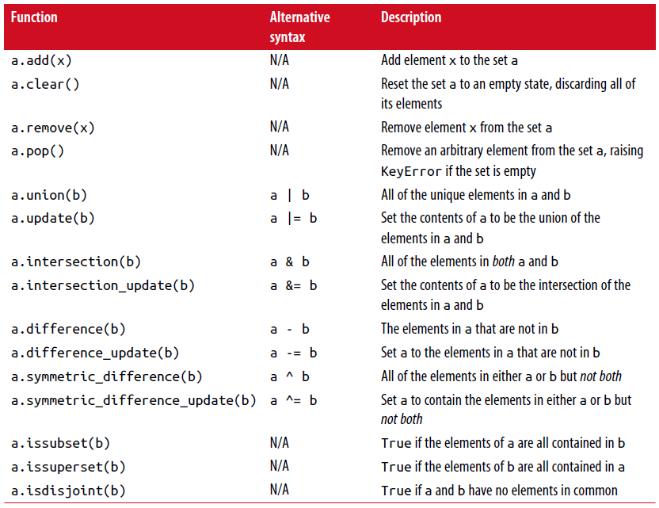

===============================
3.1 数据结构和序列
===============================

python的数据结构是简单但强大的。掌握它们的使用是成为一个熟练的python程序员的一个关键部分。

----------
元组
----------

一个元组是一个固定长度，不可变序列的python对象。
最简单的方式去创建一个元组是用一个逗号分隔序列的值：

.. code-block:: python

    >>> tup = 4, 5, 6
    >>> tup
    (4, 5, 6)

当你在一个复杂的表达式中定义一个元组时，它是十分有必要用一个圆括号将值围起来，如在这个例子中，在一个元组中创建元组：

.. code-block:: python

    >>> nested_tup = (4, 5, 6), (7, 8)
	
    >>> nested_tup
    ((4, 5, 6), (7, 8))

----------
列表
----------

与元组对比，列表是可变长度的，它们的内容可以原位修改。
你可以使用方括号[]或使用list类型函数：

.. code-block:: python

    >>> a_list = [2, 3, 7, None]
    >>> tup = ('foo', 'bar', 'baz')
    >>> b_list = list(tup)
    >>> b_list
    ['foo', 'bar', 'baz']
    >>> b_list[1] = 'peekaboo'
	>>> b_list
	['foo', 'peekaboo', 'baz']
	
列表和元组在语义上(semantically)是相似的（虽然元组不能被修改），在许多函数中可被替换(interchangeably)使用。

列表函数经常被作为一种具体化一个迭代器或生成表达式方式使用在数据处理：

.. code-block:: python

	In [42]: gen = range(10)
	In [43]: gen
	Out[43]: range(0, 10)
	In [44]: list(gen)
	Out[44]: [0, 1, 2, 3, 4, 5, 6, 7, 8, 9]

~~~~~~~~~~~~~~~~~
添加和移除元素
~~~~~~~~~~~~~~~~~

使用append方法可以追加元素到列表末端

使用insert方法可以在列表的特定位置插入一个元素

插入索引必须在0到列表长度之间，两端值也都包括(inclusive)。

注意：插入比追加计算昂贵，因为涉及的子列必须在内部移动以为新元素腾出位置。
如果你需要在一个序列的开头和结尾处插入元素，为此，你可以研究collection.deque，一个双端列队。

~~~~~~~~~~~~~~~~
连接和组合列表
~~~~~~~~~~~~~~~~

与元组相似，把两个列表加在一起使用+连接它们：

如果你已经定义了一个list，你可以使用extend方法追加多个元素到list:

~~~~~~~~~~~~~~~~~
排序
~~~~~~~~~~~~~~~~~

你可以通过调用list的sort方法原位(in-plance)排序它（没有创建一个新list）：

.. code-block:: python

	In [61]: a = [7, 2, 5, 1, 3]
	
	In [62]: a.sort()
	
	In [63]: a
	Out[63]: [1, 2, 3, 5, 7]
	
sort有几个选项偶尔会派上用场(come in handy). 
一种是能够传递一个二级排序键--产生一个值来排序对象的函数。
例如，我们可以通过字符串长度来排序一个字符串容器：

.. code-block:: python

	In [64]: b = ['saw', 'small', 'He', 'foxes', 'six']
	
	In [65]: b.sort(key=len)
	
	In [66]: b
	Out[66]: ['He', 'saw', 'six', 'small', 'foxes']
	
很快我们将关注sorted函数，可以产生一个通用序列排好序的副本。

~~~~~~~~~~~~~~~~~~~~~~~~~~~~~~~~~~~~~~~
二分搜索(Binary search)和维护排序列表
~~~~~~~~~~~~~~~~~~~~~~~~~~~~~~~~~~~~~~~

内置的bisect模块实现二进制搜索并插入到排好序的列表中。
bisect.bisect查找一个元素应该被插入的位置，插入后还是排好序的，bisect.insort实际插入元素到那个位置：

.. code-block:: python

	In [67]: import bisect
	
	In [68]: c = [1, 2, 2, 2, 3, 4, 7]
	
	In [69]: bisect.bisect(c, 2)
	Out[69]: 4
	
	In [70]: bisect.bisect(c, 5)
	Out[70]: 6
	
	In [71]: bisect.insort(c, 6)
	
	In [72]: c
	Out[72]: [1, 2, 2, 2, 3, 4, 6, 7]
	
注意：bisect模块函数并不检查list是否已经排好序，因为检查的计算成本太高。
因此，在一个未排好序的list上使用它们的操作可以成功不报错，但是可能得到的结果并不正确。

~~~~~~~~~~~~~~~~~~~
切片
~~~~~~~~~~~~~~~~~~~

你可以通过切片记号(notation)选择大多数序列类型对象的部分，由start:stop基本形式组成传递给索引操作[]：

.. code-block:: python

	In [73]: seq = [7, 2, 3, 7, 5, 6, 0, 1]
	In [74]: seq[1:5]
	Out[74]: [2, 3, 7, 5]

切片的对象也可以由一个序列赋值：

.. code-block:: python

	In [75]: seq[3:4] = [6, 3]
	In [76]: seq
	Out[76]: [7, 2, 3, 6, 3, 5, 6, 0, 1]

因为在start索引的元素被包含，stop索引的不被包含，所以元素数量是stop-start。

start或stop都可以被省略(omit)，在这种情况下，默认分别从序列的开头和序列结尾：

.. code-block:: python

	In [77]: seq[:5]
	Out[77]: [7, 2, 3, 6, 3]
	
	In [78]: seq[3:]
	Out[78]: [6, 3, 5, 6, 0, 1]

负索引(negative indices)将序列相对于末尾切片：

.. code-block:: python

	In [79]: seq[-4:]
	Out[79]: [5, 6, 0, 1]
	
	In [80]: seq[-6:-2]
	Out[80]: [6, 3, 5, 6]

切片语义需要一些习惯，特别是，如果你来自R或MATLAB。
图3-1对正负整数切片是一个有用的指导。
在图中，索引显示在格子边缘，帮助显示使用正负整数索引切片选择的开始和结束位置。

第二个冒号后可以使用一个步长，用以每隔几个取元素::

	In [81]: seq[::2]
	Out[81]: [7, 3, 3, 6, 1]

一种机智的使用是使步长为-1，可以反向一个list或tuple::

	In [82]: seq[::-1]
	Out[82]: [1, 0, 6, 5, 3, 6, 3, 2, 7]

---------------
内置序列函数
---------------

Python有几个(a handful of)有用的序列函数，您应该熟悉并随时使用它们。

~~~~~~~~~~~
enumerate
~~~~~~~~~~~

迭代序列时想要跟踪当前项索引是很常见的。
你自己做的方式可能是这样的::

	i = 0
	for value in collection:
		# do something with value
		i += 1

因为这是常见的，python有一个内建函数，enumerate，返回一个(i, value)元组序列::

	for i, value in enumerate(collection):
		# do something with value

当你在索引数据时，一个有用的使用enumerate模式是生成一个映射序列（假定是唯一的）值到它们在序列中位置的dict::

	In [83]: some_list = ['foo', 'bar', 'baz']
	
	In [84]: mapping = {}
	In [85]: for i, v in enumerate(some_list):
		....: mapping[v] = i
		
	In [86]: mapping
	Out[86]: {'bar': 1, 'baz': 2, 'foo': 0}

~~~~~~~~
sorted
~~~~~~~~

sorted函数从任何序列的元素返回一个新的排好序的list::

	In [87]: sorted([7, 1, 2, 6, 0, 3, 2])
	Out[87]: [0, 1, 2, 2, 3, 6, 7]
	
	In [88]: sorted('horse race')
	Out[88]: [' ', 'a', 'c', 'e', 'e', 'h', 'o', 'r', 'r', 's']

sorted函数在列表上接受和sort函数相同的参数。

~~~~
zip
~~~~

zip配对许多列表、元组或其它序列来创建一个元组列表::

	In [89]: seq1 = ['foo', 'bar', 'baz']
	In [90]: seq2 = ['one', 'two', 'three']
	
	In [91]: zipped = zip(seq1, seq2)
	
	In [92]: list(zipped)
	Out[92]: [('foo', 'one'), ('bar', 'two'), ('baz', 'three')]

zip可以操作任意长度的序列，它产生的元素长度取决于最短的序列::

	In [93]: seq3 = [False, True]
	
	In [94]: list(zip(seq1, seq2, seq3))
	Out[94]: [('foo', 'one', False), ('bar', 'two', True)]

zip一个很常见的使用是可能结合enumerate同时(simultaneously)迭代多个序列::

	In [95]: for i, (a, b) in enumerate(zip(seq1, seq2)):
		....: print('{0}: {1}, {2}'.format(i, a, b))
		....:
	0: foo, one
	1: bar, two
	2: baz, three

给一个"zipped"序列，zip可以被聪明的应用于"unzip"序列。
另一种方式实现这个是通过转换一行list到一列list。语法看起来有点神奇::

	In [96]: pitchers = [('Nolan', 'Ryan'), ('Roger', 'Clemens'),
		....: ('Schilling', 'Curt')]
		
	In [97]: first_names, last_names = zip(*pitchers)
	
	In [98]: first_names
	Out[98]: ('Nolan', 'Roger', 'Schilling')
	
	In [99]: last_names
	Out[99]: ('Ryan', 'Clemens', 'Curt')

~~~~~~~~~~
reversed
~~~~~~~~~~

reversed在反向顺序迭代序列元素::

	In [100]: list(reversed(range(10)))
	Out[100]: [9, 8, 7, 6, 5, 4, 3, 2, 1, 0]

记住，reversed是一个生成器（稍后将对此进行更详细的讨论），所以在具体化之前它不会创建一个反向序列（例如用list或for循环）。

------------
字典
------------

dict可能是python中最重要的内置数据结构。
一个更常见的名字是哈希表或关联数组。
它是一个可变大小的键-值对容器，键和值都是python的对象。创建字典的一种方式是使用花括号(curly braces)，并用冒号分隔键值::

	In [101]: empty_dict = {}
	
	In [102]: d1 = {'a' : 'some value', 'b' : [1, 2, 3, 4]}
	
	In [103]: d1
	Out[103]: {'a': 'some value', 'b': [1, 2, 3, 4]}

你可以使用和操作列表或元组相同的语法访问、插入、赋值元素::

	In [104]: d1[7] = 'an integer'
	
	In [105]: d1
	Out[105]: {'a': 'some value', 'b': [1, 2, 3, 4], 7: 'an integer'}
	
	In [106]: d1['b']
	Out[106]: [1, 2, 3, 4]

你可以使用和检查一个列表或元组是否包含一个值相同的语法检查一个字典是否包含一个键::

	In [107]: 'b' in d1
	Out[107]: True

你可以使用del关键字或pop方法删除键（删除键同时返回值）::

	In [108]: d1[5] = 'some value'
	
	In [109]: d1
	Out[109]:
	{'a': 'some value',
	'b': [1, 2, 3, 4],
	7: 'an integer',
	5: 'some value'}
	
	In [110]: d1['dummy'] = 'another value'
	
	In [111]: d1
	Out[111]:
	{'a': 'some value',
	'b': [1, 2, 3, 4],
	7: 'an integer',
	5: 'some value',
	'dummy': 'another value'}
	
	In [112]: del d1[5]
	
	In [113]: d1
	Out[113]:
	{'a': 'some value',
	'b': [1, 2, 3, 4],
	7: 'an integer',
	'dummy': 'another value'}
	
	In [114]: ret = d1.pop('dummy')
	
	In [115]: ret
	Out[115]: 'another value'
	
	In [116]: d1
	Out[116]: {'a': 'some value', 'b': [1, 2, 3, 4], 7: 'an integer'}

keys和values方法分别给你字典键和值的迭代器。
虽然键值对没有某种特别的顺序，但这两个函数输出的键和值列表是在相同的顺序::

	In [117]: list(d1.keys())
	Out[117]: ['a', 'b', 7]

	In [118]: list(d1.values())
	Out[118]: ['some value', [1, 2, 3, 4], 'an integer']

你可以使用update方法融合一个字典到另一个中::

	In [119]: d1.update({'b' : 'foo', 'c' : 12})
	
	In [120]: d1
	Out[120]: {'a': 'some value', 'b': 'foo', 7: 'an integer', 'c': 12}

update方法原位修改字典，所以任何被传递去更新的数据，已存在的键它原来的值将丢弃。

~~~~~~~~~~~~~~~~~~~~
从序列创建字典
~~~~~~~~~~~~~~~~~~~~

经常有想把两个序列逐元素配对成字典的情况。
第一次尝试，你可能写的代码像下面这样::

	mapping = {}
	for key, value in zip(key_list, value_list):
	mapping[key] = value

由于(since)dict本质上(essentially)是2元组的集合，因此dict函数接受一个2元组列表::

	In [121]: mapping = dict(zip(range(5), reversed(range(5))))
	
	In [122]: mapping
	Out[122]: {0: 4, 1: 3, 2: 2, 3: 1, 4: 0}

后面我们将讨论dict comprehensions，另一种构建字典的优雅方式。

~~~~~~~~~~~~~~~~~
默认值
~~~~~~~~~~~~~~~~~

下面逻辑很常见::

	if key in some_dict:
		value = some_dict[key]
	else:
		value = default_value

字典方法get和pop能返回一个默认值，所以上面if-else语句块可以如下简写::

	value = some_dict.get(key, default_value)

如果key不存在get默认返回None，pop将抛出一个异常。
对于赋值，一种常见的情况是dict中的值是其他集合，如列表。
例如，你可以想象用单词的第一个字母对单词列表进行分类，形成一个列表字典::

	In [123]: words = ['apple', 'bat', 'bar', 'atom', 'book']
	
	In [124]: by_letter = {}
	In [125]: for word in words:
	.....: 		letter = word[0]
	.....: 		if letter not in by_letter:
	.....: 			by_letter[letter] = [word]
	.....: 		else:
	.....: 			by_letter[letter].append(word)
	.....:
	In [126]: by_letter
	Out[126]: {'a': ['apple', 'atom'], 'b': ['bat', 'bar', 'book']}

setdefault字典方法精确用于此目的。前面的(**preceding**)for循环可以写成::

	for word in words:
		letter = word[0]
		by_letter.setdefault(letter, []).append(word)

内置collections模块有一个有用的defaultdict类，让这个甚至更简单。
要创建一个，对于每个字典位置，你可以传递一个类型或函数来生成默认值::

	from collections import defaultdict
	by_letter = defaultdict(list)
	for word in words:
		by_letter[word[0]].append(word)

~~~~~~~~~~~~~~~~~
合法的字典键类型
~~~~~~~~~~~~~~~~~

尽管字典值可以是任何字典类型，但键通常是不可变对象，如标量(**scalar**)类型(int, float, string)、元组（所有在元组中的对象也要是不可变的）。
技术术语叫可哈希能力(hashability)。
你可以用hash函数检查一个对象是否是可哈希的::

	In [127]: hash('string')
	Out[127]: 5023931463650008331
	
	In [128]: hash((1, 2, (2, 3)))
	Out[128]: 1097636502276347782
	
	In [129]: hash((1, 2, [2, 3])) # fails because lists are mutable
	---------------------------------------------------------------------------
	TypeError Traceback (most recent call last)
	<ipython-input-129-800cd14ba8be> in <module>()
	----> 1 hash((1, 2, [2, 3])) # fails because lists are mutable
	TypeError: unhashable type: 'list'

如果要使用一个list作为键，可将其转为tuple，只要它的元素也能够被哈希::

	In [130]: d = {}
	
	In [131]: d[tuple([1, 2, 3])] = 5
	
	In [132]: d
	Out[132]: {(1, 2, 3): 5}

---------------
集合
---------------

set是一个无序且元素唯一的容器。
你可以把它看成仅仅有键没有值的字典。
集合可以使用两种方式创建：通过set函数或花括号{}::

	In [133]: set([2, 2, 2, 1, 3, 3])
	Out[133]: {1, 2, 3}

	In [134]: {2, 2, 2, 1, 3, 3}
	Out[134]: {1, 2, 3}

set支持集合的数学运算，如并集、交集(intersection,)、差、和对称差(symmetric difference)。考虑下面两个示例集合::

	In [135]: a = {1, 2, 3, 4, 5}

	In [136]: b = {3, 4, 5, 6, 7, 8}

两个集合的并是出现在每个集合不同的元素的集合。
使用union方法或|二进制操作符可以计算集合的并::

	In [137]: a.union(b)
	Out[137]: {1, 2, 3, 4, 5, 6, 7, 8}

	In [138]: a | b
	Out[138]: {1, 2, 3, 4, 5, 6, 7, 8}

交集包含两个集合都有的元素。&操作符或intersection方法可以计算两个集合的交集::

	In [139]: a.intersection(b)
	Out[139]: {3, 4, 5}

	In [140]: a & b
	Out[140]: {3, 4, 5}

常用集合方法见表3-1.

所有逻辑集合操作都具有就地对应(in-place counterparts)，使得你可以用结果替换操作符左侧的集合内容。
对一个很大的集合来说，这可能是更有效率的::

	In [141]: c = a.copy()

	In [142]: c |= b

	In [143]: c
	Out[143]: {1, 2, 3, 4, 5, 6, 7, 8}

	In [144]: d = a.copy()

	In [145]: d &= b

	In [146]: d
	Out[146]: {3, 4, 5}

像字典和集合的元素通常是不可变的。如果有像列表一样的元素，必须将其转换为元组::

	In [147]: my_data = [1, 2, 3, 4]

	In [148]: my_set = {tuple(my_data)}

	In [149]: my_set
	Out[149]: {(1, 2, 3, 4)}

你也可检查一个集合是否是另一个集合的子集或超集::

	In [150]: a_set = {1, 2, 3, 4, 5}

	In [151]: {1, 2, 3}.issubset(a_set)
	Out[151]: True

	In [152]: a_set.issuperset({1, 2, 3})
	Out[152]: True

集合相等当且仅当它们的内容相等::

	In [153]: {1, 2, 3} == {3, 2, 1}
	Out[153]: True

-------------------------------------------
列表、字典和集合推导(**comprehensions**)
-------------------------------------------

列表推导是最受喜欢的python特性之一。
它允许你简明地从容器过滤元素生成一个新列表，在一个简明表达式传入过滤器转换元素，它的基本形式是::

	[expr for val in collection if condition]

这与下面的for循环等效::

	result = []
	for val in collection:
		if condition:
			result.append(expr)

过滤条件可以省略，仅留下表达式。
例如，给定一个字符串列表，我们过滤字符串长度小于等于2的，同时将首字母转成大写，像这样::

	In [154]: strings = ['a', 'as', 'bat', 'car', 'dove', 'python']

	In [155]: [x.upper() for x in strings if len(x) > 2]
	Out[155]: ['BAT', 'CAR', 'DOVE', 'PYTHON']

集合和字典推导是天然的扩展，在惯用地(**idiomatically**)相似方式产生集合和字典。
字典理解像这个::

	dict_comp = {key-expr : value-expr for value in collection if condition}

集合推导除了用花括号代替方括号外，与字典推导看起来很像::

	set_comp = {expr for value in collection if condition}

像列表推导一样，集合和字典推导主要(mostly)是便利，但是它们同样(similarly)可以使代码更容易编写和阅读。
考虑来自前面的字符串列表。
假设我们想要一个包含容器中字符串长度的集合，我们可以很方便地使用集合推导来计算::

	In [156]: unique_lengths = {len(x) for x in strings}
	
	In [157]: unique_lengths
	Out[157]: {1, 2, 3, 4, 6}

我们还可以使用map函数，在功能上更具表达性::

	In [158]: set(map(len, strings))
	Out[158]: {1, 2, 3, 4, 6}

作为一个简单的字典推导例子，我们可以创建一个字符串到它们在列表中位置的查阅表::

	In [159]: loc_mapping = {val : index for index, val in enumerate(strings)}
	
	In [160]: loc_mapping
	Out[160]: {'a': 0, 'as': 1, 'bat': 2, 'car': 3, 'dove': 4, 'python': 5}

~~~~~~~~~~~~~~~~~~
嵌套列表推导
~~~~~~~~~~~~~~~~~~

假定我们有一个包含一些英语和西班牙名字的列表的列表::

	In [161]: all_data = [['John', 'Emily', 'Michael', 'Mary', 'Steven'],
	.....: 	['Maria', 'Juan', 'Javier', 'Natalia', 'Pilar']]

你可能从几个文件得到这些名字，决定通过语言组织它们。
现在，假如我们想要得到包含大于等于两个字母'e'的全部名字的单个列表。
我们当然可以用一个简单的循环实现它::

	names_of_interest = []
	for names in all_data:
		enough_es = [name for name in names if name.count('e') >= 2]
		names_of_interest.extend(enough_es)

你实际上可以将整个操作包装(wrap)在单个嵌套列表解析中，像这样::

	In [162]: result = [name for names in all_data for name in names if name.count('e') >= 2]
	
	In [163]: result
	Out[163]: ['Steven']

首先，嵌套列表推导有点难以理解(a bit hard to wrap your head around)。
列表推导的for部分按照嵌套顺序排列(arrange)，任何过滤条件像之前一样放在末尾。
这里是另一个“扁平化(flantten)”整型元组列表到一个简单的整型列表中的例子::

	In [164]: some_tuples = [(1, 2, 3), (4, 5, 6), (7, 8, 9)]
	
	In [165]: flattened = [x for tup in some_tuples for x in tup]
	
	In [166]: flattened
	Out[166]: [1, 2, 3, 4, 5, 6, 7, 8, 9]

记住，如果你要写一个嵌套for代替列表推导，for表达式的顺序是相同的::

	flattened = []

	for tup in some_tuples:
		for x in tup:
			flattened.append(x)

你可以有任意多水平嵌套，但是如果你有超过2或3层嵌套，你可能要开始疑问，站在代码可读性角度这是否有意义。
展示从一个列表推导里面嵌套列表推导，对区分语法而言是重要的，也是完全有效的(**?**)::

	In [167]: [[x for x in tup] for tup in some_tuples]
	Out[167]: [[1, 2, 3], [4, 5, 6], [7, 8, 9]]

这会生成一个列表的列表，而不是所有内部元素的展平列表。
