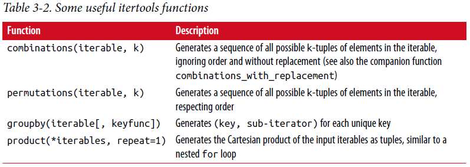

===============================
3.2 函数
===============================

函数是python中初级的、最重要的代码组织和重用方式。
根据经验(as a rule of thumb)，如果你有预料要重复相同或相似的代码，写一个可重复使用的函数可能值得。
通过给代码块取一个名字，函数也可以增加你的代码可读性。

函数使用def关键字声明，从return关键字处返回::

	def my_function(x, y, z=1.5):
		if z > 1:
			return z * (x + y)
		else:
			return z / (x + y)

有多个return语句没有问题。
如果到达函数的结尾处还没有遇到(**encounter**)返回语句，python自动返回None。

每个函数可以有位置参数和关键字参数。
关键字参数常用来指定默认值或作为可选参数。
在前面的(**preceding**, adj)函数中，x和y是位置参数，z是关键参数。
这意味着函数可以用以下这些方式中任一种调用::

	my_function(5, 6, z=0.7)
	my_function(3.14, 7, 3.5)
	my_function(10, 20)

关于函数参数的主要限制在于位置参数必须要在关键字参数（如果有）前。
你可以用任意顺序指定关键字参数。
这将你从记忆函数参数位置中解放出来，仅仅需要记住参数的名字。

注：
也可以使用关键字参数代替位置参数。
在前面函数例子中，我们也可以这样写::

	my_function(x=5, y=6, z=7)
	my_function(y=6, x=5, z=7)

在某些情况下这可以帮助增加代码可读性。

------------------------------
名字空间、作用域和局部函数
------------------------------

函数在两种不同的作用域内可访问变量：全局和局部。
在python中，变量作用域更具描述力的名字叫名字空间。
任何在函数内被赋值的变量默认是局部名字空间。
局部名字空间在函数被调用时创建，立即由函数参数充填(**populate**).
在函数结束时，局部名字空间被释放（在本章范围(**purview**)外有一些例外）。
考虑下面函数::

	def func():
		a = []
		for i in range(5):
			a.append(i)

在func()被调用时，空列表a被创建，5个元素被追加进列表，在函数退出时a被释放。假如我们用如下的声明a::

	a = []
	def func():
		for i in range(5):
			a.append(i)

在函数作用域外赋值变量是可能的，但是要通过global关键字声明变量::

	In [168]: a = None
	
	In [169]: def bind_a_variable():
	.....: 		global a
	.....: 		a = []
	.....: 	bind_a_variable()
	.....:
	In [170]: print(a)
	[]

注意：
我一般不鼓励使用global关键字。全局变量在储存系统有些状态时使用比较典型。
如果你发现自己使用的比较多，你可能要考虑使用面向对象的编程（使用类）。

------------
返回多个值
------------

当我使用过Java和C++后，第一次使用python编程时，我最喜爱的特性之一就是能够用一个简单的语法使函数返回多个值。这里有一个例子::

	def f():
		a = 5
		b = 6
		c = 7
		return a, b, c
		
	a, b, c = f()

在数据分析和其它的科学应用中，你经常发现自己干这件事。
函数在这里实际上返回的是一个对象，叫元组，被解包到结果变量中去了。
在之前的例子中，我们可以这样做::

	return_value = f()

在这种情况，return_value将是一个有三个返回变量的三元元组。
像以前，一个可能具有吸引力的代替方案是使用字典返回多个值::

	def f():
		a = 5
		b = 6
		c = 7
		return {'a' : a, 'b' : b, 'c' : c}

这种替代方案是有用的，取决于你想尝试做什么。

---------------
函数是对象
---------------

因为python函数是对象，所以在其他语言中难以表达的结构在Python中是比较容易表达的。
假如我们正在做数据清洗工作，需要对下列字符串列表进行一些列的变换::

	In [171]: states = [' Alabama ', 'Georgia!', 'Georgia', 'georgia', 'FlOrIda',
	.....: 	'south carolina##', 'West virginia?']

任何处理过用户提交的调查数据都会见到这些凌乱的结果。
需要做很多事情来使这个字符串列表统一为分析做准备：移除空格，删除标点(**punctuation**)符号，并标准化适当的大小写。
做这件事的一种方式是使用内置的字符串方法以及(along with)re标准库模块的常用表达式::

	import re
	
	def clean_strings(strings):
		result = []
		for value in strings:
			value = value.strip()
			value = re.sub('[!#?]', '', value)
			value = value.title()
			result.append(value)
		return result

结果像这样::

	In [173]: clean_strings(states)
	Out[173]:
	['Alabama',
	'Georgia',
	'Georgia',
	'Georgia',
	'Florida',
	'South Carolina',
	'West Virginia']

一种有用的替代方法是生成一个操作列表，应用到具体的字符串集合::

	def remove_punctuation(value):
		return re.sub('[!#?]', '', value)
		
	clean_ops = [str.strip, remove_punctuation, str.title]
	
	def clean_strings(strings, ops):
		result = []
		for value in strings:
			for function in ops:
				value = function(value)
			result.append(value)
		return result

结果如下::

	In [175]: clean_strings(states, clean_ops)
	Out[175]:
	['Alabama',
	'Georgia',
	'Georgia',
	'Georgia',
	'Florida',
	'South Carolina',
	'West Virginia']

像这样更具函数性模型使你能够在一个很高水平更简单地修改字符串变换方法。
clean_strings函数现在也更具可重用性和通用性(**generic**)。

你可以将函数作为其它函数的参数，如内置的map函数，对一个序列应用函数::

	In [176]: for x in map(remove_punctuation, states):
	.....: 	print(x)
	Alabama
	Georgia
	Georgia
	georgia
	FlOrIda
	south carolina
	West virginia

---------------------
匿名（Lambda）函数
---------------------
Python支持所谓的匿名的或叫lambda函数，是写只包含一条语句的函数的方式，语句的结果是函数的返回值。
使用lambda关键字定义匿名函数，除了“我们正在声明一个匿名函数”外没有其他意思::

	def short_function(x):
		return x * 2
	equiv_anon = lambda x: x * 2

我们通常在本书的剩下部分称这些函数为lambda函数。它们在数据分析方面尤其有用，因为你将看到，在许多情况下数据转换函数使用函数作为参数。
传递lambda函数通常输入较少（和更清晰），而不是编写完全函数声明，或甚至将lambda函数赋值给局部变量。 例如，考虑这个例子::

	def apply_to_list(some_list, f):
		return [f(x) for x in some_list]
	
	ints = [4, 0, 1, 5, 6]
	apply_to_list(ints, lambda x: x * 2)

你也可以写[x * 2 for x in ints],但是这里我们可以简洁地(**succinctly**)传递一份定制的操作给apply_to_list函数。
另一个例子，假设你想分类一个字符串容器，通过每个字符串中可区分的字母::

	In [177]: strings = ['foo', 'card', 'bar', 'aaaa', 'abab']

这里我们传递一个lambda函数给list的sort方法::

	In [178]: strings.sort(key=lambda x: len(set(list(x))))
	
	In [179]: strings
	Out[179]: ['aaaa', 'foo', 'abab', 'bar', 'card']

提醒：
匿名函数被叫做lambda函数的一个原因是，不像用def定义(declared)的函数，函数对象本身没有一个明确的__name__属性。

-------------------------------------
Currying:部分(**partical**)参数应用
-------------------------------------

Currying是计算机科学的行话(以数学家Haskell Curry命名(**named after**))，意思是通过部分参数应用从已存在的函数中得到(**derive**)新函数。
举例，假设我们有一个不重要的函数，两个数相加::

	def add_numbers(x, y):
		return x + y

使用这个函数，我们得到一个变量的新函数，add_five, 加5到这个参数上::

	add_five = lambda y: add_numbers(5, y)

add_number函数的第二个参数被叫做currying。这儿没有什么有趣的东西，我们实际做的就是定义一个新函数，调用已存在的函数。
内置functools模型的partial函数可以简化这一过程::

	from functools import partial
	add_five = partial(add_numbers, 5)

---------------
生成器
---------------

有一致的方式迭代如list中的objects或文件中的lines等序列，是一种重要的Python特性。
这是通过(by means of)迭代器协议(iterator protocol)实现的，迭代器协议是使对象可迭代的(iterable)通用(**generic**)方法。 例如，迭代dict会产生dict键::

	In [180]: some_dict = {'a': 1, 'b': 2, 'c': 3}
	In [181]: for key in some_dict:
	.....: 		print(key)
	a
	b
	c

当你写for key in some_dict, Python解释器首先会尝试创建some_dict之外的迭代器::

		In [182]: dict_iterator = iter(some_dict)
		In [183]: dict_iterator
		Out[183]: <dict_keyiterator at 0x7fbbd5a9f908>

当像for循环这样的上下文中被使用到，迭代器是yield到Python解释器中的任何对象。
许多参数是list或类似list的对象的方法也接受任何迭代器对象作为参数。这包括内建的方法如min、max和sum，以及类型构造函数如list、tuple::

	In [184]: list(dict_iterator)
	Out[184]: ['a', 'b', 'c']

生成器是构造迭代器对象的一种简洁方式。正常函数执行和返回单个结果每次，生成器以懒加载方式返回多个结果的一个序列，在返回一个结果后暂停知道下一个结果被请求。
为创建生成器，在函数中使用yield关键字代替return::

	def squares(n=10):
		print('Generating squares from 1 to {0}'.format(n ** 2))
		for i in range(1, n + 1):
			yield i ** 2

当你实际调用生成器时，没有代码被立即执行::

	In [186]: gen = squares()
	In [187]: gen
	Out[187]: <generator object squares at 0x7fbbd5ab4570>

直到你从生成器中请求元素，它开始执行它的代码::

	In [188]: for x in gen:
	.....: 		print(x, end=' ')
	Generating squares from 1 to 100
	1 4 9 16 25 36 49 64 81 100

~~~~~~~~~~~~~~~~
生成器表达式
~~~~~~~~~~~~~~~~

另一种甚至更简洁的方式产生生成器是使用生成器表达式。
这种生成器类似于(**analogue**)列表、字典和集合推导。
创建生成器，括起列表推导使用圆括号(**parentheses**)代替方括号(**breckets**)::

	In [189]: gen = (x ** 2 for x in range(100))
	In [190]: gen
	Out[190]: <generator object <genexpr> at 0x7fbbd5ab29e8>

这完全与下面更为繁杂的生成器等效::

	def _make_gen():
		for x in range(100):
			yield x ** 2
	gen = _make_gen()

在大量场合，生成器表达式可以代替列表推导作为函数参数::

	In [191]: sum(x ** 2 for x in range(100))
	Out[191]: 328350
	
	In [192]: dict((i, i **2) for i in range(5))
	Out[192]: {0: 0, 1: 1, 2: 4, 3: 9, 4: 16}

~~~~~~~~~~~~~~~~
itertools模块
~~~~~~~~~~~~~~~~

标准库itertools模块为大量通用数据算法而写的生成器集合。
例如，groupby用任何序列和函数作为参数，通过参数中函数返回值分组序列中连续的(**consecutive**)元素。这里有一个例子::

	In [193]: import itertools
	
	In [194]: first_letter = lambda x: x[0]
	
	In [195]: names = ['Alan', 'Adam', 'Wes', 'Will', 'Albert', 'Steven']
	
	In [196]: for letter, names in itertools.groupby(names, first_letter):
	.....: 		print(letter, list(names)) # names is a generator
	A ['Alan', 'Adam']
	W ['Wes', 'Will']
	A ['Albert']
	S ['Steven']

表3-2是其它itertools函数清单，这些函数时常让我觉得很有用。
更多关于这些有用的内置实用模块，你要去查看Python官方的文档。

	
---------------
错误和异常处理
---------------

仔细处理Python错误或异常时构建健壮程序的重要部分。
在数据分析应用中，许多函数仅在特定输入下起作用。
举一个例子，Python的float函数能够转换字符串为浮点数，但不恰当的输入会执行失败产生ValueError::

	In [197]: float('1.2345')
	Out[197]: 1.2345
	In [198]: float('something')
	---------------------------------------------------------------------------
	ValueError Traceback (most recent call last)
	<ipython-input-198-439904410854> in <module>()
	----> 1 float('something')
	ValueError: could not convert string to float: 'something'

假定我们想要一个优雅版本的float函数，执行失败返回输入参数。
我们可以通过写一个函数在try/except块围住float调用来做这件事::

	def attempt_float(x):
	try:
		return float(x)
	except:
		return x

在except中的代码仅在float(x)抛出一个异常情况下执行::

	In [200]: attempt_float('1.2345')
	Out[200]: 1.2345

	In [201]: attempt_float('something')
	Out[201]: 'something'

你可能注意到float不仅可以抛出ValueError异常::

	In [202]: float((1, 2))
	---------------------------------------------------------------------------
	TypeError Traceback (most recent call last)
	<ipython-input-202-842079ebb635> in <module>()
	----> 1 float((1, 2))
	TypeError: float() argument must be a string or a number, not 'tuple'

您可能只想处理(**suppress**)ValueError，因为TypeError（输入不是字符串或数值）可能表示程序中存在合法(**legitimate**)错误。
写异常类型在except后面来做这个::

	def attempt_float(x):
	try:
		return float(x)
	except ValueError:
		return x

然后我们有::

	In [204]: attempt_float((1, 2))
	---------------------------------------------------------------------------
	TypeError Traceback (most recent call last)
	<ipython-input-204-9bdfd730cead> in <module>()
	----> 1 attempt_float((1, 2))
	<ipython-input-203-3e06b8379b6b> in attempt_float(x)
		1 def attempt_float(x):
		2 try:
	----> 3 return float(x)
		4 except ValueError:
		5 return x
	TypeError: float() argument must be a string or a number, not 'tuple'

我们可以通过写一个异常类型的元组来捕捉多个异常（要写圆括号）::

	def attempt_float(x):
	try:
		return float(x)
	except (TypeError, ValueError):
		return x

在一些场合，你可能不想去处理异常，但是你想要一些代码被执行无论try代码块执行成功与否。
使用finally来做这个::

	f = open(path, 'w')
	try:
		write_to_file(f)
	finally:
		f.close()

这里文件句柄f总是要关闭。
类似地，你也可以有代码块仅仅在try:代码块执行成功情况下执行，使用else::

	f = open(path, 'w')
	try:
		write_to_file(f)
	except:
		print('Failed')
	else:
		print('Succeeded')
	finally:
		f.close()

~~~~~~~~~~~~~~~~
IPython中异常
~~~~~~~~~~~~~~~~

当你通过%运行一个脚本或执行任何语句抛出异常，IPython将默认打印一个完整的调用堆栈追踪(traceback)，其中包含堆栈中每个点位置周围的几行上下文::

	In [10]: %run examples/ipython_bug.py
	---------------------------------------------------------------------------
	AssertionError Traceback (most recent call last)
	/home/wesm/code/pydata-book/examples/ipython_bug.py in <module>()
		13 throws_an_exception()
		14
	---> 15 calling_things()
	
	/home/wesm/code/pydata-book/examples/ipython_bug.py in calling_things()
		11 def calling_things():
		12 works_fine()
	---> 13 throws_an_exception()
		14
		15 calling_things()
		
	/home/wesm/code/pydata-book/examples/ipython_bug.py in throws_an_exception()
		7 a = 5
		8 b = 6
	----> 9 assert(a + b == 10)
		10
		11 def calling_things():
		
	AssertionError:

自身有额外的内容相较于其它标准Python解释器（不提供附加内容）是一个很大优势。
你可以使用%xmodoe魔术方法控制显示的内容数量，从Plain（和标准Python解释器一样）到Verbose（其中内联函数参数值等）。你将在在后面章节看到，你也可以在错误发生后进入堆栈(使用%debug或%pdb魔法)交互式分析(**post-mortem**)调试。