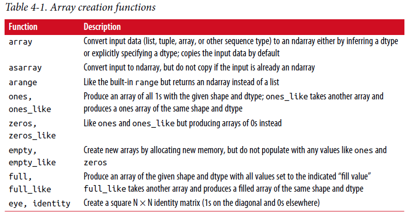
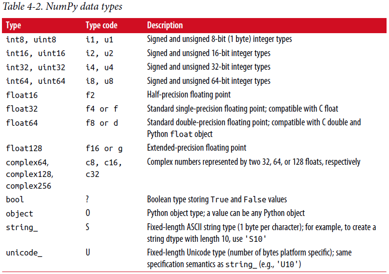
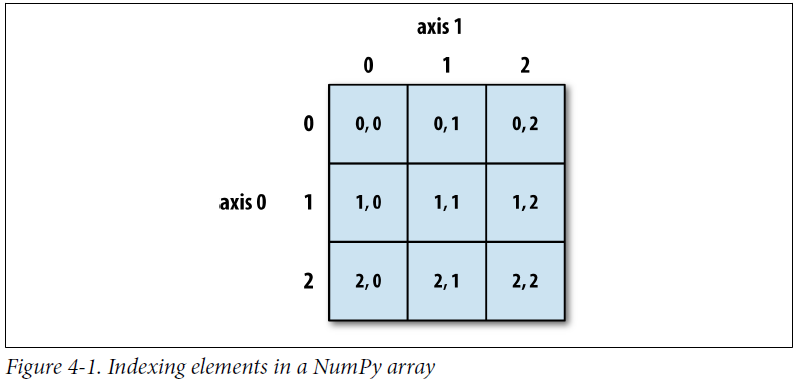
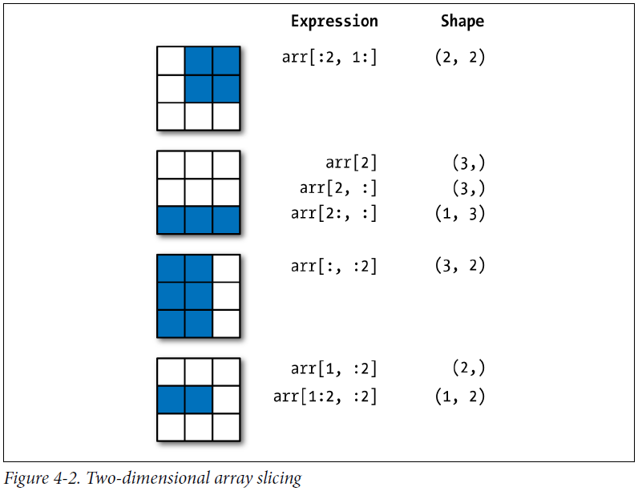

====================================
4.1 NumPy ndarray：一个多维数组对象
====================================

NumPy最关键的特点之一是它的N维数组对象，或者叫ndarray，在Python中是一个快速、灵活的大数据集容器。
数组使你能够使用相似的语法在整个数据块上执行数学操作，与在标量元素上有相同效果的操作。

为了让您了解NumPy如何使用类似语法对于内置Python对象的标量值启用批量计算，我首先导入NumPy并生成一个小的随机数据数组::

	In [12]: import numpy as np

	# Generate some random data
	In [13]: data = np.random.randn(2, 3)

	In [14]: data
	Out[14]:
	array([[-0.2047, 0.4789, -0.5194],
	[-0.5557, 1.9658, 1.3934]])

然后我对数据施加数学操作::

	In [15]: data * 10
	Out[15]:
	array([[ -2.0471, 4.7894, -5.1944],
	[ -5.5573, 19.6578, 13.9341]])

	In [16]: data + data
	Out[16]:
	array([[-0.4094, 0.9579, -1.0389],
	[-1.1115, 3.9316, 2.7868]])

在第一个例子中，全部元素都被乘上了10。第二个例子，在数组每个"格子"相应位置值和每个自己相加。

注：
在本章和全书，我使用标准NumPy简写import numpy as np。当然，欢迎放from numpy import \*在你的代码中，避免一直写np.，但是我不建议这样的习惯。
numpy名字空间是很大的，包含许多名字和内置Python函数冲突的函数（像min和max）。

ndarray是用于同类(**homogeneous**)数据的通用多维容器;
这是说，所有的元素必须是相同类型。每个数组有一个shape。一个表示每个维度大小的元组，dtype，描述数组数据类型的对象::

	In [17]: data.shape
	Out[17]: (2, 3)
	
	In [18]: data.dtype
	Out[18]: dtype('float64')

这章讲给你介绍基本的NumPy数组使用，会大量出现于本书的剩余部分。
虽然不必要深入理解NumPy的许多数据分析应用程序，但是精通(**proficient**)面向数组的编程和思考是成为科学计算Python专家(**guru**)的关键一步。

注：
不管在文中你是见到array、NumPy array还是ndarray，除少数例外外，它们都是指相同的东西：ndarray对象。

---------------
创建ndarray
---------------

创建一个数组的最简单方式是使用array函数。
它接受任何序列对象（包括其它数组），产生一个新的包含传入数据的NumPy数组。举例，列表是转换的好选择::

	In [19]: data1 = [6, 7.5, 8, 0, 1]

	In [20]: arr1 = np.array(data1)

	In [21]: arr1
	Out[21]: array([ 6. , 7.5, 8. , 0. , 1. ])

嵌套序列，如等长度列表的列表。将转换成一个多维数组::

	In [22]: data2 = [[1, 2, 3, 4], [5, 6, 7, 8]]

	In [23]: arr2 = np.array(data2)

	In [24]: arr2
	Out[24]:
	array([[1, 2, 3, 4],
	[5, 6, 7, 8]])

由于data2是一个列表的列表，因此从数据推断NumPy数组arr2有有两个维度的shape。
我们可以通过检查ndim和shape属性来验证这个::

	In [25]: arr2.ndim
	Out[25]: 2

	In [26]: arr2.shape
	Out[26]: (2, 4)

除非明确指定，否则np.array尝试为它创建的数组推断一个合适的数据类型。
数据类型是被储存在特殊的元数据对象dtype中；
举例，在之前的两个例子中我们有::

	In [27]: arr1.dtype
	Out[27]: dtype('float64')

	In [28]: arr2.dtype
	Out[28]: dtype('int64')

除了np.array还有许多其它函数可以创建新数组。
例如，zeros和ones分别创建全0或全1的数组，使用给定的长度或shape。empty创建没有初始化值到具体值的数组。
为了用这些方法创建更高维度的数组，传一个元组给shape::

	In [29]: np.zeros(10)
	Out[29]: array([ 0., 0., 0., 0., 0., 0., 0., 0., 0., 0.])

	In [30]: np.zeros((3, 6))
	Out[30]:
	array([[ 0., 0., 0., 0., 0., 0.],
	[ 0., 0., 0., 0., 0., 0.],
	[ 0., 0., 0., 0., 0., 0.]])

	In [31]: np.empty((2, 3, 2))
	Out[31]:
	array([[[ 0., 0.],
	[ 0., 0.],
	[ 0., 0.]],
	[[ 0., 0.],
	[ 0., 0.],
	[ 0., 0.]]])

注意：
假定np.empty返回一个全0的数组不安全。
在某些情况，它可能返回未初始化的"垃圾"值。

arange是Python内建range函数的一个数组值版本::

	In [32]: np.arange(15)
	Out[32]: array([ 0, 1, 2, 3, 4, 5, 6, 7, 8, 9, 10, 11, 12, 13, 14])

见表4-1 标准数组创建函数短列表。
由于NumPy关注于数值计算，数据类型如果未指定，在许多情况下是float64（浮点）。

----------------------
ndarray数据类型
----------------------

数据类型或dtype是一类特殊的对象，包含信息（或元数据，关于数据的数据）ndarray需要将一块内存解释为特定的数据类型::

	In [33]: arr1 = np.array([1, 2, 3], dtype=np.float64)
	In [34]: arr2 = np.array([1, 2, 3], dtype=np.int32)
	In [35]: arr1.dtype
	Out[35]: dtype('float64')
	In [36]: arr2.dtype
	Out[36]: dtype('int32')

dtype是NumPy与其它系统交互数据的灵活性来源。
在大多数情况下，它们直接映射到底层磁盘或内存表示，可以轻松读取和写入二进制数据流数据到磁盘以及连接到用C或Fortran等低级语言编写的代码。
dtype数值以相同方式命名：一个类型名如float或int，随后是一个表明每个元素占多少位的数字。标准双精度浮点数占8个字节或64位。
因此，这种类型在NumPy中被命名为float64。见表4-2 NumPy支持的数据类型全面清单。

注：不要担心记忆NumPy数据类型，尤其是你现在还是一个新手时。
仅仅有必要关心你正在处理的通用数据种类，是浮点数。复数、整型、布尔型还是一般的Python对象。
当你需要更多地控制在磁盘和内存中数据储存方式时，特别是大型数据集，最好知道你控制的储存类型。

你能显式转换或铸造(**cast**)一个数组从一种dtype到另一种，使用ndarray的adtype方法::

	In [37]: arr = np.array([1, 2, 3, 4, 5])

	In [38]: arr.dtype
	Out[38]: dtype('int64')

	In [39]: float_arr = arr.astype(np.float64)

	In [40]: float_arr.dtype
	Out[40]: dtype('float64')

在这个例子中，整型被转换成浮点型。
如果我转换一些浮点数字到一个整型dtype，小数部分将被丢弃::

	In [41]: arr = np.array([3.7, -1.2, -2.6, 0.5, 12.9, 10.1])

	In [42]: arr
	Out[42]: array([ 3.7, -1.2, -2.6, 0.5, 12.9, 10.1])

	In [43]: arr.astype(np.int32)
	Out[43]: array([ 3, -1, -2, 0, 12, 10], dtype=int32)

如果你有代表数字的字符串数组，你可以使用astype转换它们到数值形式::

	In [44]: numeric_strings = np.array(['1.25', '-9.6', '42'], dtype=np.string_)

	In [45]: numeric_strings.astype(float)
	Out[45]: array([ 1.25, -9.6 , 42. ])

注意：谨慎使用numpy.string_type，因为string是固定大小，可能丢弃输入而没有警告。
pandas对非数字数据有更直观的开箱即用(**out-of-the-box**)行为。

如果由于一些原因（如字符串不能别转换成float64）转换失败，ValueError将抛出。
这儿我有点懒，写了float代替np.float64；NumPy将Python类型别名为其自己的等效数据类型。
你也可以使用另一种数组dtype属性::

	In [46]: int_array = np.arange(10)

	In [47]: calibers = np.array([.22, .270, .357, .380, .44, .50], dtype=np.float64)

	In [48]: int_array.astype(calibers.dtype)
	Out[48]: array([ 0., 1., 2., 3., 4., 5., 6., 7., 8., 9.])

有速记(**shorthand**)类型代码字符串，你可以指定一个dtype::

	In [49]: empty_uint32 = np.empty(8, dtype='u4')

	In [50]: empty_uint32
	Out[50]:
	array([ 0, 1075314688, 0, 1075707904, 0,
	1075838976, 0, 1072693248], dtype=uint32)

注：
调用astype一直会创建一个新数组（数据的一份拷贝），即使新dtype与老dtype相同。

--------------------------------------------
使用NumPy数组进行算术运算(**arithmetic**)
--------------------------------------------

数组是重要的因为它不需要使用for循环就可以表达数据的批量操作。
NumPy使用者称此为向量化。
任何在相同尺寸数组之间的算术操作都将操作应用到每个元素上::

	In [51]: arr = np.array([[1., 2., 3.], [4., 5., 6.]])

	In [52]: arr
	Out[52]:
	array([[ 1., 2., 3.],
	[ 4., 5., 6.]])

	In [53]: arr * arr
	Out[53]:
	array([[ 1., 4., 9.],
	[ 16., 25., 36.]])

	In [54]: arr - arr
	Out[54]:
	array([[ 0., 0., 0.],
	[ 0., 0., 0.]])

与标量的算术操作将操作扩散(**propagate**)到数组中每个元素::

	In [55]: 1 / arr
	Out[55]:
	array([[ 1. , 0.5 , 0.3333],
	[ 0.25 , 0.2 , 0.1667]])

	In [56]: arr ** 0.5
	Out[56]:
	array([[ 1. , 1.4142, 1.7321],
	[ 2. , 2.2361, 2.4495]])

相同大小之间的比较产生布尔数组::

	In [57]: arr2 = np.array([[0., 4., 1.], [7., 2., 12.]])

	In [58]: arr2
	Out[58]:
	array([[ 0., 4., 1.],
	[ 7., 2., 12.]])

	In [59]: arr2 > arr
	Out[59]:
	array([[False, True, False],
	[ True, False, True]], dtype=bool)

在不同大小数组之间操作称之为广播(**broadcasting**)，将在附录A中详细讨论。本书的大部分不需要深入理解广播。

-----------------------
基本索引和切片
-----------------------

NumPy数组索引是一个丰富的主题，因为有许多方法可以从你的数据中选择子集或单个元素。
一维数组很简单，表面上看与Python列表操作相似::

	In [60]: arr = np.arange(10)

	In [61]: arr
	Out[61]: array([0, 1, 2, 3, 4, 5, 6, 7, 8, 9])

	In [62]: arr[5]
	Out[62]: 5

	In [63]: arr[5:8]
	Out[63]: array([5, 6, 7])

	In [64]: arr[5:8] = 12

	In [65]: arr
	Out[65]: array([ 0, 1, 2, 3, 4, 12, 12, 12, 8, 9])

如你看到的，你可以给切片赋一个标量值，像在arr[5:8] = 12，值被扩散到整个选中区域。
与Python列表一个重要的区别是数组切片是原始数组视图。
这意味着数据没有拷贝，任何对视图的修改将反映到源数组中。

给一个这样的例子，我首先创建arr的一个切片::

	In [66]: arr_slice = arr[5:8]

	In [67]: arr_slice
	Out[67]: array([12, 12, 12])

现在当我改变arr_slice值，变化(**mutation**)反映到原始数组arr中::

	In [68]: arr_slice[1] = 12345

	In [69]: arr
	Out[69]: array([ 0, 1, 2, 3, 4, 12, 12345, 12, 8,
	9])

"光秃秃"的切片将给一个数组中所有元素赋值::

	In [70]: arr_slice[:] = 64

	In [71]: arr
	Out[71]: array([ 0, 1, 2, 3, 4, 64, 64, 64, 8, 9])

如果你是NumPy新手，你可能对此感到惊讶，尤其如果你使用过其它编程语言，拷贝数据很常见。
由于NumPy被设计处理很大的数组，如果NumPy坚持一直拷贝数据，你可以想象到性能和内存问题。

注意：
如果你想要ndarray切片的一个拷贝而不是试图，你需要显示拷贝数组-例如，arr[5:8].copy()。

处理更高维数组，你有更多选项。
在二维数组中，每个索引元素不再是标量而是一维数组::

	In [72]: arr2d = np.array([[1, 2, 3], [4, 5, 6], [7, 8, 9]])

	In [73]: arr2d[2]
	Out[73]: array([7, 8, 9])

单个元素可以递归访问。
但是那样要做更多工作，你能传递一个逗号分隔的索引列表来选择单个元素。
它们有相同的效果::

	In [74]: arr2d[0][2]
	Out[74]: 3

	In [75]: arr2d[0, 2]
	Out[75]: 3

见图4-1二维数组索引说明。
我发现将轴0想成"行"轴1想成"列"是有帮助的。

在多维数组中，如果你省略后面的索引，返回的对象将是包含沿更高维全部数据的更低维ndarray。
所以在2x2x3数组arr3d::

	In [76]: arr3d = np.array([[[1, 2, 3], [4, 5, 6]], [[7, 8, 9], [10, 11, 12]]])

	In [77]: arr3d
	Out[77]:
	array([[[ 1, 2, 3],
	[ 4, 5, 6]],
	[[ 7, 8, 9],
	[10, 11, 12]]])

	arr3d[0]是2x3数组::

	In [78]: arr3d[0]
	Out[78]:
	array([[1, 2, 3],
	[4, 5, 6]])

标量或数组都可以赋给arr3d[0]::

	In [79]: old_values = arr3d[0].copy()
	
	In [80]: arr3d[0] = 42
	
	In [81]: arr3d
	Out[81]:
	array([[[42, 42, 42],
	[42, 42, 42]],
	[[ 7, 8, 9],
	[10, 11, 12]]])
	
	In [82]: arr3d[0] = old_values

	In [83]: arr3d
	Out[83]:
	array([[[ 1, 2, 3],
	[ 4, 5, 6]],
	[[ 7, 8, 9],
	[10, 11, 12]]])

类似地，arr3d[1, 0]给你索引从(1, 0)开始的所有值，形成一个1维数组::

	In [84]: arr3d[1, 0]
	Out[84]: array([7, 8, 9])

这个表达式得到的结果与上面的相同，虽然我们索引了两步::

	In [85]: x = arr3d[1]

	In [86]: x
	Out[86]:
	array([[ 7, 8, 9],
	[10, 11, 12]])

	In [87]: x[0]
	Out[87]: array([7, 8, 9])

注意上面全部例子里，数组被选中的子集返回数组都是视图。

~~~~~~~~~~~~~~~~~~~
使用切片进行索引
~~~~~~~~~~~~~~~~~~~

一维对象像Python列表，ndarray使用相似的语法切片::

	In [88]: arr
	Out[88]: array([ 0, 1, 2, 3, 4, 64, 64, 64, 8, 9])

	In [89]: arr[1:6]
	Out[89]: array([ 1, 2, 3, 4, 64])

考虑之前的二维数组，arr2d。切片这个数组有点不同::

	In [90]: arr2d
	Out[90]:
	array([[1, 2, 3],
	[4, 5, 6],
	[7, 8, 9]])

	In [91]: arr2d[:2]
	Out[91]:
	array([[1, 2, 3],
	[4, 5, 6]])

正如你看到的，它沿着轴0，第一个轴切片。
切片，沿着某个轴选择一定范围的元素。看表达式arr2d[:2]作为"选择arr2d的前两行"是有帮助的。

你能传递多个切片就像你可以传递多个索引一样::

	In [92]: arr2d[:2, 1:]
	Out[92]:
	array([[2, 3],
	[5, 6]])

像这样切片，你可以获得相同维度的数组视图。
通过混合整型索引和切片，你可以得到更低维度切片。

例如，我能选择第二行但是仅仅前两列，像这样::

	In [93]: arr2d[1, :2]
	Out[93]: array([4, 5])

类似地，我能选择第三列但是仅仅前两行，像这样::

	In [94]: arr2d[:2, 2]
	Out[94]: array([3, 6])

见图4-2的说明。
注意逗号本身意味着对全部轴操作，所以你可以仅仅在更高维轴通过这样切片::

	In [95]: arr2d[:, :1]
	Out[95]:
	array([[1],
	[4],
	[7]])

当然，赋值给一个切片表达式等于赋值给整个选中内容::

	In [96]: arr2d[:2, 1:] = 0

	In [97]: arr2d
	Out[97]:
	array([[1, 0, 0],
	[4, 0, 0],
	[7, 8, 9]])

---------------
布尔索引
---------------

让我们考虑一个例子，我们有一些数据在数组中，数组中有重复的名字。
这里我将使用numpy.random中randn函数来生成一些随机正态(normally)分布数据::

	In [98]: names = np.array(['Bob', 'Joe', 'Will', 'Bob', 'Will', 'Joe', 'Joe'])

	In [99]: data = np.random.randn(7, 4)

	In [100]: names
	Out[100]:
	array(['Bob', 'Joe', 'Will', 'Bob', 'Will', 'Joe', 'Joe'],
	dtype='<U4')

	In [101]: data
	Out[101]:
	array([[ 0.0929, 0.2817, 0.769 , 1.2464],
	[ 1.0072, -1.2962, 0.275 , 0.2289],
	[ 1.3529, 0.8864, -2.0016, -0.3718],
	[ 1.669 , -0.4386, -0.5397, 0.477 ],
	[ 3.2489, -1.0212, -0.5771, 0.1241],
	[ 0.3026, 0.5238, 0.0009, 1.3438],
	[-0.7135, -0.8312, -2.3702, -1.8608]])

假定每个名字对应data数组中每一行并且我们想要选中对应名字"Bob"的所有行。
像算术操作，数组的比较也被向量化了。
因此，比较names和字符串"Bob"产生一个布尔型数组::

	In [102]: names == 'Bob'
	Out[102]: array([ True, False, False, True, False, False, False], dtype=bool)

	这个布尔数组可以被传递来索引数组::

	In [103]: data[names == 'Bob']
	Out[103]:
	array([[ 0.0929, 0.2817, 0.769 , 1.2464],
	[ 1.669 , -0.4386, -0.5397, 0.477 ]])

布尔数组必须与它索引数组的轴相同长度。
你甚至可以混合和用索引或整型（或整型序列；稍后介绍）匹配布尔数组。

注意：
如果布尔数组长度不正确，布尔选择不会失败，所以建议小心使用这个特性。

在这些例子中，我选择names == 'Bob'的行，也索引列::

	In [104]: data[names == 'Bob', 2:]
	Out[104]:
	array([[ 0.769 , 1.2464],
	[-0.5397, 0.477 ]])

	In [105]: data[names == 'Bob', 3]
	Out[105]: array([ 1.2464, 0.477 ])

要选中除了'Bob'的所有内容，你可以使用!=或使用~否定条件::

	In [106]: names != 'Bob'
	Out[106]: array([False, True, True, False, True, True, True], dtype=bool)

	In [107]: data[~(names == 'Bob')]
	Out[107]:
	array([[ 1.0072, -1.2962, 0.275 , 0.2289],
	[ 1.3529, 0.8864, -2.0016, -0.3718],
	[ 3.2489, -1.0212, -0.5771, 0.1241],
	[ 0.3026, 0.5238, 0.0009, 1.3438],
	[-0.7135, -0.8312, -2.3702, -1.8608]])

~操作符是有用的当你想反向一个一般条件::

	In [108]: cond = names == 'Bob'

	In [109]: data[~cond]
	Out[109]:
	array([[ 1.0072, -1.2962, 0.275 , 0.2289],
	[ 1.3529, 0.8864, -2.0016, -0.3718],
	[ 3.2489, -1.0212, -0.5771, 0.1241],
	[ 0.3026, 0.5238, 0.0009, 1.3438],
	[-0.7135, -0.8312, -2.3702, -1.8608]])

结合多个布尔条件选中三个名字中的两个，使用布尔算术操作符像 &(且) 和 !(或)::

	In [110]: mask = (names == 'Bob') | (names == 'Will')

	In [111]: mask
	Out[111]: array([ True, False, True, True, True, False, False], dtype=bool)

	In [112]: data[mask]
	Out[112]:
	array([[ 0.0929, 0.2817, 0.769 , 1.2464],
	[ 1.3529, 0.8864, -2.0016, -0.3718],
	[ 1.669 , -0.4386, -0.5397, 0.477 ],
	[ 3.2489, -1.0212, -0.5771, 0.1241]])

通过布尔索引从一个数组选择数据一直创建数据的一个副本，即使返回数组没有变化。

注意：
Python关键字and和or不能使用在布尔数组中，使用&和|代替。

使用布尔数组设置值是显而易见的(**common-sense**, 尝试的)。
要设置data中所有负值为0，我们仅要做::

	In [113]: data[data < 0] = 0

	In [114]: data
	Out[114]:
	array([[ 0.0929, 0.2817, 0.769 , 1.2464],
	[ 1.0072, 0. , 0.275 , 0.2289],
	[ 1.3529, 0.8864, 0. , 0. ],
	[ 1.669 , 0. , 0. , 0.477 ],
	[ 3.2489, 0. , 0. , 0.1241],
	[ 0.3026, 0.5238, 0.0009, 1.3438],
	[ 0. , 0. , 0. , 0. ]])

使用一维布尔数组设置全部的行或列也很简单::

	In [115]: data[names != 'Joe'] = 7

	In [116]: data
	Out[116]:
	array([[ 7. , 7. , 7. , 7. ],
	[ 1.0072, 0. , 0.275 , 0.2289],
	[ 7. , 7. , 7. , 7. ],
	[ 7. , 7. , 7. , 7. ],
	[ 7. , 7. , 7. , 7. ],
	[ 0.3026, 0.5238, 0.0009, 1.3438],
	[ 0. , 0. , 0. , 0. ]])

我们将在后面看到，这种类型操作在二维数组上使用pandas来做是很方便的。

---------------------------
花式索引(Fancy indexing)
---------------------------

Fancy indexing 是NumPy采用的术语来描述使用整型数组索引。
假设我们有一个8x4的数组::

	In [117]: arr = np.empty((8, 4))

	In [118]: for i in range(8):
	.....: arr[i] = i

	In [119]: arr
	Out[119]:
	array([[ 0., 0., 0., 0.],
	[ 1., 1., 1., 1.],
	[ 2., 2., 2., 2.],
	[ 3., 3., 3., 3.],
	[ 4., 4., 4., 4.],
	[ 5., 5., 5., 5.],
	[ 6., 6., 6., 6.],
	[ 7., 7., 7., 7.]])

为了选出特定顺序行的子集，你可以简化传一个列表或整型的adarray指明想要的顺序::

	In [120]: arr[[4, 3, 0, 6]]
	Out[120]:
	array([[ 4., 4., 4., 4.],
	[ 3., 3., 3., 3.],
	[ 0., 0., 0., 0.],
	[ 6., 6., 6., 6.]])

希望这段代码符合您的预期！ 使用负索引从末端选择行::

	In [121]: arr[[-3, -5, -7]]
	Out[121]:

	array([[ 5., 5., 5., 5.],
	[ 3., 3., 3., 3.],
	[ 1., 1., 1., 1.]])

传递多个索引数组有点不同；它选择一个一维数组元素对应于每个元组索引::

	In [122]: arr = np.arange(32).reshape((8, 4))

	In [123]: arr
	Out[123]:
	array([[ 0, 1, 2, 3],
	[ 4, 5, 6, 7],
	[ 8, 9, 10, 11],
	[12, 13, 14, 15],
	[16, 17, 18, 19],
	[20, 21, 22, 23],
	[24, 25, 26, 27],
	[28, 29, 30, 31]])

	In [124]: arr[[1, 5, 7, 2], [0, 3, 1, 2]]
	Out[124]: array([ 4, 23, 29, 10])

我们将在附录A中看到reshape方法的细节。

这里选择了元素(1, 0), (5, 3), (7, 1)和(2, 2)。
无论数组有多少维度（这里只有2），花式索引的结果总是一维的。

这种情况下花式索引与一些使用者（包括我自己）期待的有点不同，通过选择矩阵行列的子集形成一个矩形区域。
这儿是得到的矩形区域的一种方式::

	In [125]: arr[[1, 5, 7, 2]][:, [0, 3, 1, 2]]
	Out[125]:
	array([[ 4, 7, 5, 6],
	[20, 23, 21, 22],
	[28, 31, 29, 30],
	[ 8, 11, 9, 10]])

记住，不像切片，花式索引一直拷贝数据到一个新的数组中。

-------------------
数组转置和交换轴
-------------------

转置是一种特殊形式的重塑，相似地返回数据的**视图**而没有拷贝任何东西。数组有transpose方法也有特殊的T属性::

	In [126]: arr = np.arange(15).reshape((3, 5))

	In [127]: arr
	Out[127]:
	array([[ 0, 1, 2, 3, 4],
	[ 5, 6, 7, 8, 9],
	[10, 11, 12, 13, 14]])
	
	In [128]: arr.T
	Out[128]:
	array([[ 0, 5, 10],
	[ 1, 6, 11],
	[ 2, 7, 12],
	[ 3, 8, 13],
	[ 4, 9, 14]])

你可能经常要做矩阵计算-例如，当使用np.dot计算矩阵内积结果时::

	In [129]: arr = np.random.randn(6, 3)

	In [130]: arr
	Out[130]:
	array([[-0.8608, 0.5601, -1.2659],
	[ 0.1198, -1.0635, 0.3329],
	[-2.3594, -0.1995, -1.542 ],
	[-0.9707, -1.307 , 0.2863],
	[ 0.378 , -0.7539, 0.3313],
	[ 1.3497, 0.0699, 0.2467]])

	In [131]: np.dot(arr.T, arr)
	Out[131]:
	array([[ 9.2291, 0.9394, 4.948 ],
	[ 0.9394, 3.7662, -1.3622],
	[ 4.948 , -1.3622, 4.3437]])

对于更高维度的数组，转置将接受轴编号的元组来置换轴（for extra mind bending，这句话没理解）::

	In [132]: arr = np.arange(16).reshape((2, 2, 4))
	
	In [133]: arr
	Out[133]:
	array([[[ 0, 1, 2, 3],
	[ 4, 5, 6, 7]],
	[[ 8, 9, 10, 11],
	[12, 13, 14, 15]]])
	
	In [134]: arr.transpose((1, 0, 2))
	Out[134]:
	array([[[ 0, 1, 2, 3],
	[ 8, 9, 10, 11]],
	[[ 4, 5, 6, 7],
	[12, 13, 14, 15]]])
			
.. note::
	将0轴和1轴交换意思是新的arr[0][1][0]是原来的arr[1][0][0], 新的arr[0][1][1]是原来的arr[1][0][1]。
	转置操作有点抽象。

这儿，轴被重排，第二个轴变成第一个轴，第一个轴变成第二个，最后一个轴没有改变。

.T简单转置是交换轴的特殊情况。ndarray有swapaxes方法，它接受一对轴号并切换指示的轴以重新排列数据::

	In [135]: arr
	Out[135]:
	array([[[ 0, 1, 2, 3],
	[ 4, 5, 6, 7]],
	[[ 8, 9, 10, 11],
	[12, 13, 14, 15]]])
	
	In [136]: arr.swapaxes(1, 2)
	Out[136]:
	array([[[ 0, 4],
	[ 1, 5],
	[ 2, 6],
	[ 3, 7]],
	[[ 8, 12],
	[ 9, 13],
	[10, 14],
	[11, 15]]])

swapaxes类似返回数据视图没有拷贝。
