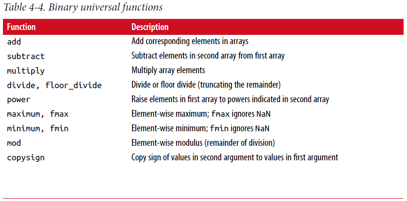
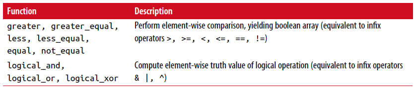

===============================================
4.2 通用函数：快速逐元素(element-wise)数组函数
===============================================

通用函数或ufunc是在ndarray数据上执行逐元素操作的函数。
你可以把它们看成是传入一个或多个标量值产生一个或多个标量结果简单函数的快速向量化包装器。

许多ufunc是简单的逐元素变换，像sqrt或exp::

	In [137]: arr = np.arange(10)

	In [138]: arr
	Out[138]: array([0, 1, 2, 3, 4, 5, 6, 7, 8, 9])

	In [139]: np.sqrt(arr)
	Out[139]:
	array([ 0. , 1. , 1.4142, 1.7321, 2. , 2.2361, 2.4495,
	2.6458, 2.8284, 3. ])

	In [140]: np.exp(arr)
	Out[140]:
	array([ 1. , 2.7183, 7.3891, 20.0855, 54.5982,
	148.4132, 403.4288, 1096.6332, 2980.958 , 8103.0839])

这些被称为一元ufunc。其他的，例如add或maximum，取两个数组（因此成为二元ufuncs）并返回一个数组作为结果::

	In [141]: x = np.random.randn(8)

	In [142]: y = np.random.randn(8)

	In [143]: x
	Out[143]:
	array([-0.0119, 1.0048, 1.3272, -0.9193, -1.5491, 0.0222, 0.7584,
	-0.6605])

	In [144]: y
	Out[144]:
	array([ 0.8626, -0.01 , 0.05 , 0.6702, 0.853 , -0.9559, -0.0235,
	-2.3042])

	In [145]: np.maximum(x, y)
	Out[145]:
	array([ 0.8626, 1.0048, 1.3272, 0.6702, 0.853 , 0.0222, 0.7584,
	-0.6605])

这里，numpy.maximun在x和y之间逐元素计算最大的元素。

虽然(while)不常见，但ufunc可以返回多个数组。
modf是一个例子，Python内置divmod的一个向量化版本；
它返回一个浮点数组的小数部分和整数部分::

	In [146]: arr = np.random.randn(7) * 5

	In [147]: arr
	Out[147]: array([-3.2623, -6.0915, -6.663 , 5.3731, 3.6182, 3.45 , 5.0077])

	In [148]: remainder, whole_part = np.modf(arr)

	In [149]: remainder
	Out[149]: array([-0.2623, -0.0915, -0.663 , 0.3731, 0.6182, 0.45 , 0.0077])

	In [150]: whole_part
	Out[150]: array([-3., -6., -6., 5., 3., 3., 5.])

ufuncs接受一个可选的输出参数允许进行数组原位操作::

	In [151]: arr
	Out[151]: array([-3.2623, -6.0915, -6.663 , 5.3731, 3.6182, 3.45 , 5.0077])

	In [152]: np.sqrt(arr)
	Out[152]: array([ nan, nan, nan, 2.318 , 1.9022, 1.8574, 2.2378])

	In [153]: np.sqrt(arr, arr)
	Out[153]: array([ nan, nan, nan, 2.318 , 1.9022, 1.8574, 2.2378])

	In [154]: arr
	Out[154]: array([ nan, nan, nan, 2.318 , 1.9022, 1.8574, 2.2378])

见表4-3和4-4 可用ufuncs清单

Table 4-3. Unary ufuncs

.. image:: images/Table_4-3__Unary_ufuncs.png
	:width: 800
	

	

