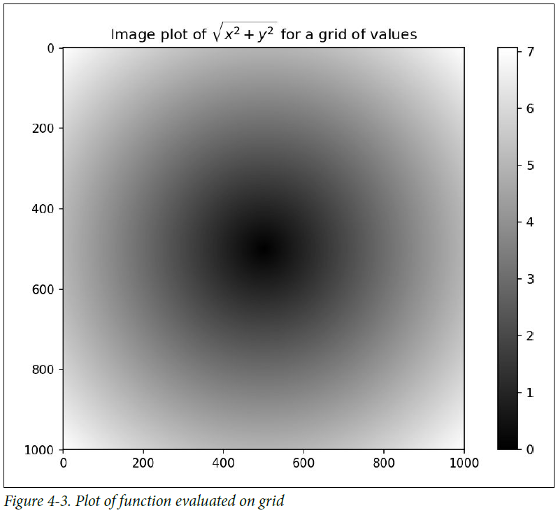

===============================
4.3 面向数组的数组编程
===============================

使用NumPy数组使你能够用简洁的数组表达式表达许多数据处理任务而不要写循环。
用数组表达式替换显示循环的实践一般称为向量化。
一般，向量化操作时常比纯Python等效实现快一两个（或更多）数量级，在任何种类的数值计算上影响更大。
在附录A中，我阐述了广播(broadcasting),一种对于向量化计算强大的方法。

举个简单的例子，假设我们希望通过规则的网格值求函数sqrt(x^2 + y^2)值。
np.meshgrid函数接受2个一维数组并产生2个二维矩阵，对应于两个数组中的所有（x，y）对::

	In [155]: points = np.arange(-5, 5, 0.01) # 1000 equally spaced points

	In [156]: xs, ys = np.meshgrid(points, points)

	In [157]: ys
	Out[157]:
	array([[-5. , -5. , -5. , ..., -5. , -5. , -5. ],
	[-4.99, -4.99, -4.99, ..., -4.99, -4.99, -4.99],
	[-4.98, -4.98, -4.98, ..., -4.98, -4.98, -4.98],
	...,
	[ 4.97, 4.97, 4.97, ..., 4.97, 4.97, 4.97],
	[ 4.98, 4.98, 4.98, ..., 4.98, 4.98, 4.98],
	[ 4.99, 4.99, 4.99, ..., 4.99, 4.99, 4.99]])

现在计算函数值是写两个点相同表达式的事::

	In [158]: z = np.sqrt(xs ** 2 + ys ** 2)

	In [159]: z
	Out[159]:
	array([[ 7.0711, 7.064 , 7.0569, ..., 7.0499, 7.0569, 7.064 ],
	[ 7.064 , 7.0569, 7.0499, ..., 7.0428, 7.0499, 7.0569],
	[ 7.0569, 7.0499, 7.0428, ..., 7.0357, 7.0428, 7.0499],
	...,
	[ 7.0499, 7.0428, 7.0357, ..., 7.0286, 7.0357, 7.0428],
	[ 7.0569, 7.0499, 7.0428, ..., 7.0357, 7.0428, 7.0499],
	[ 7.064 , 7.0569, 7.0499, ..., 7.0428, 7.0499, 7.0569]])

作为第9章的预览，我使用matplotlib来创建这个二维数组的可视化::

	In [160]: import matplotlib.pyplot as plt

	In [161]: plt.imshow(z, cmap=plt.cm.gray); plt.colorbar()
	Out[161]: <matplotlib.colorbar.Colorbar at 0x7f715e3fa630>

	In [162]: plt.title("Image plot of $\sqrt{x^2 + y^2}$ for a grid of values")
	Out[162]: <matplotlib.text.Text at 0x7f715d2de748>

见表4-3，这里我使用matplotlib中imshow函数从一个函数值的二维数组创建图像。

--------------------------
将条件逻辑表示为数组运算
--------------------------

numpy.where是三元表达式x if condition else y的向量化版本。
假设我们有一个布尔数组和两个值数组::

	In [165]: xarr = np.array([1.1, 1.2, 1.3, 1.4, 1.5])

	In [166]: yarr = np.array([2.1, 2.2, 2.3, 2.4, 2.5])

	In [167]: cond = np.array([True, False, True, True, False])

假设相应位置的值在条件中为True时我们从xarr取值，否则从yarr取值。
列表推导做这件事可能像这样::

	In [168]: result = [(x if c else y)
	.....: for x, y, c in zip(xarr, yarr, cond)]

	In [169]: result
	Out[169]: [1.1000000000000001, 2.2000000000000002, 1.3, 1.3999999999999999, 2.5]

这有多个问题。
首先，大于大型数组这并不快（因为所有工作都是在解释的Python代码中完成的）。
第二，对于多维数组无法工作。用np.where你可以简洁地写这个::

	In [170]: result = np.where(cond, xarr, yarr)

	In [171]: result
	Out[171]: array([ 1.1, 2.2, 1.3, 1.4, 2.5])

np.where的第二第三个参数不需要是数组；
一个或两个都可以是标量。
where在数据分析中的典型使用是基于另一个数组产生一个新的值数组。
假设你有一个随机生成的矩阵数据并且你想用2替换全部的正数，用-2替换全部的负数。
用np.where做这个很简单::

	In [172]: arr = np.random.randn(4, 4)

	In [173]: arr
	Out[173]:
	array([[-0.5031, -0.6223, -0.9212, -0.7262],
	[ 0.2229, 0.0513, -1.1577, 0.8167],
	[ 0.4336, 1.0107, 1.8249, -0.9975],
	[ 0.8506, -0.1316, 0.9124, 0.1882]])

	In [174]: arr > 0
	Out[174]:
	array([[False, False, False, False],
	[ True, True, False, True],
	[ True, True, True, False],
	[ True, False, True, True]], dtype=bool)

	In [175]: np.where(arr > 0, 2, -2)
	Out[175]:
	array([[-2, -2, -2, -2],
	[ 2, 2, -2, 2],
	[ 2, 2, 2, -2],
	[ 2, -2, 2, 2]])

在使用np.where时你能结合标量和数组。
例如，我能用常数2替换arr中全部正数，像这样::

	In [176]: np.where(arr > 0, 2, arr) # set only positive values to 2
	Out[176]:
	array([[-0.5031, -0.6223, -0.9212, -0.7262],
	[ 2. , 2. , -1.1577, 2. ],
	[ 2. , 2. , 2. , -0.9975],
	[ 2. , -0.1316, 2. , 2. ]])

传递给np.where的数组可以不仅仅是大小相等的数组或标量。

---------------
数学和统计方法
---------------

