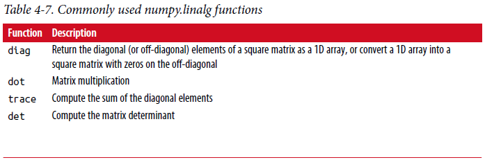
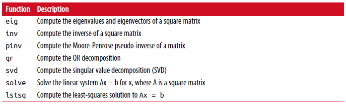

===============================
4.5 线性代数
===============================

线性代数像矩阵乘法、分解(**decompositions**)、行列式(**determinants**)和其它方阵(square matrix)数学运算是任何数组库的重要组成部分。
不像一些其它语言如MATLAB，两个二维数组用*相乘是逐元素乘积(element-wise product)而不是矩阵点积(dot product)。
因此，对于矩阵乘法有一个dot函数，一个数组方法和一个函数都在numpy名字空间中::

	In [223]: x = np.array([[1., 2., 3.], [4., 5., 6.]])

	In [224]: y = np.array([[6., 23.], [-1, 7], [8, 9]])

	In [225]: x
	Out[225]:
	array([[ 1., 2., 3.],
	[ 4., 5., 6.]])

	In [226]: y
	Out[226]:
	array([[ 6., 23.],
	[ -1., 7.],
	[ 8., 9.]])

	In [227]: x.dot(y)
	Out[227]:
	array([[ 28., 64.],
	[ 67., 181.]])

	x.dot(y)与np.dot(x, y)效果相同::

	In [228]: np.dot(x, y)
	Out[228]:
	array([[ 28., 64.],
	[ 67., 181.]])

二维数组和适当大小的一维阵列之间的矩阵乘积(product)产生一维数组::

	In [229]: np.dot(x, np.ones(3))
	Out[229]: array([ 6., 15.])

	@符号（从Python 3.5开始(as of Python 3.5)）也可以作为执行矩阵的中缀(**infix**)运算符乘法(multiplication)::

	In [230]: x @ np.ones(3)
	Out[230]: array([ 6., 15.])

numpy.linalg有一个标准矩阵分解、求逆和行列式集合。
这些是通过相同的行业标准引擎下实现的线性代数库，这个库也用于其他语言如MATLAB和R。这样的库如BLAS，LAPACK或可能（取决于您的NumPy版本）专有的英特尔MKL（数学核心库）::

	In [231]: from numpy.linalg import inv, qr

	In [232]: X = np.random.randn(5, 5)

	In [233]: mat = X.T.dot(X)

	In [234]: inv(mat)
	Out[234]:
	array([[ 933.1189, 871.8258, -1417.6902, -1460.4005, 1782.1391],
	[ 871.8258, 815.3929, -1325.9965, -1365.9242, 1666.9347],
	[-1417.6902, -1325.9965, 2158.4424, 2222.0191, -2711.6822],
	[-1460.4005, -1365.9242, 2222.0191, 2289.0575, -2793.422 ],
	[ 1782.1391, 1666.9347, -2711.6822, -2793.422 , 3409.5128]])

	In [235]: mat.dot(inv(mat))
	Out[235]:
	array([[ 1., 0., -0., -0., -0.],
	[-0., 1., 0., 0., 0.],
	[ 0., 0., 1., 0., 0.],
	[-0., 0., 0., 1., -0.],
	[-0., 0., 0., 0., 1.]])

	In [236]: q, r = qr(mat)

	In [237]: r
	Out[237]:
	array([[-1.6914, 4.38 , 0.1757, 0.4075, -0.7838],
	[ 0. , -2.6436, 0.1939, -3.072 , -1.0702],
	[ 0. , 0. , -0.8138, 1.5414, 0.6155],
	[ 0. , 0. , 0. , -2.6445, -2.1669],
	[ 0. , 0. , 0. , 0. , 0.0002]])

表达式X.T.dot(X)计算x和它的转置x.T的点积。
见表4-7 一些最常用的线性代数函数清单。

	
