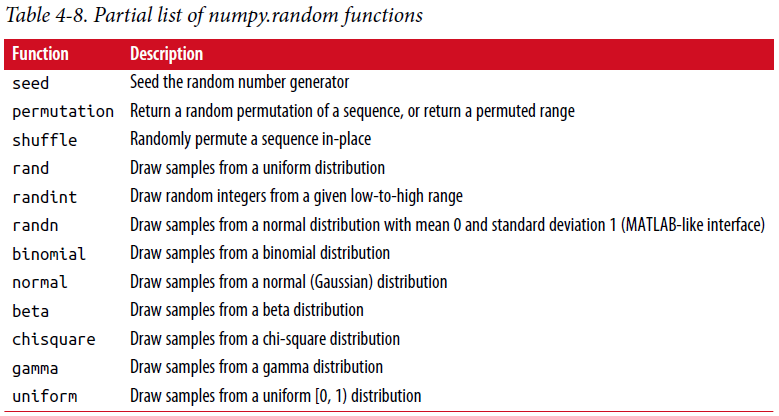

=================================
4.6 伪随机(pseudorandom)数生成
=================================

numpy.rondm模块对于高效从各种概率分布生成整个数组扩充(**supplements**)了Python内置random函数。
例如，你可以使用normal从标准正态分布采样得到一个4*4数组::

	In [238]: samples = np.random.normal(size=(4, 4))

	In [239]: samples
	Out[239]:
	array([[ 0.5732, 0.1933, 0.4429, 1.2796],
	[ 0.575 , 0.4339, -0.7658, -1.237 ],
	[-0.5367, 1.8545, -0.92 , -0.1082],
	[ 0.1525, 0.9435, -1.0953, -0.144 ]])

作为对比，Python内置random模块仅仅每次采样一个值。
从这个基准测试(**benchmark**)中可以看出，numpy.random在生成非常大的样本时要快一个数量级(an order of magnitude)::

	In [240]: from random import normalvariate

	In [241]: N = 1000000

	In [242]: %timeit samples = [normalvariate(0, 1) for _ in range(N)]
	1.77 s +- 126 ms per loop (mean +- std. dev. of 7 runs, 1 loop each)

	In [243]: %timeit np.random.normal(size=N)
	61.7 ms +- 1.32 ms per loop (mean +- std. dev. of 7 runs, 10 loops each)

我们说这是伪随机数是因为它们通过基于随机数生成器种子的一个确定性(**deterministic**)行为的算法。
你能使用np.random.seed改变NumPy的随机数生成器种子::

	In [244]: np.random.seed(1234)

在numpy.random中数据生成函数使用一个全局随机种子。
我们能使用numpy.random.RandomState创建一个与其它隔离的随机数生成器来避免全局状态::

	In [245]: rng = np.random.RandomState(1234)

	In [246]: rng.randn(10)
	Out[246]:
	array([ 0.4714, -1.191 , 1.4327, -0.3127, -0.7206, 0.8872, 0.8596,
	-0.6365, 0.0157, -2.2427])

见表4-8 numpy.random部分可用函数清单。在下一节中我将举例说明利用(**leverage**)这些函数一次生成大量样本的能力。

